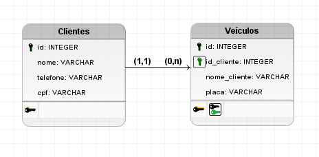
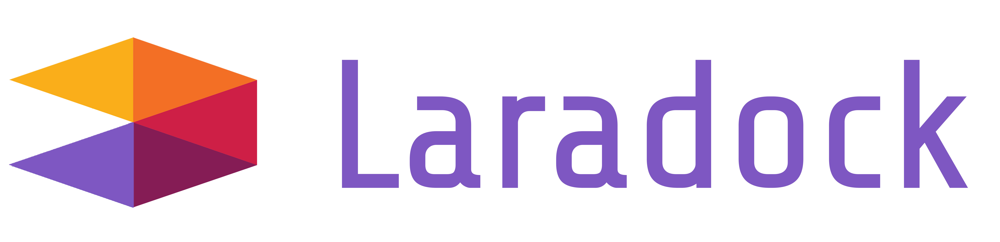

### Desafio de Programação
O desafio consistia na criação de um sistema de controle de clientes e suas respectivas placas de carro.

##### O que era necessário construir:
- ID;
- Nome;
- Telefone;
- CPF;
- Placa do Carro;

##### API REST:
Para o gerenciamento dessa base, será necessário contruir uma API REST contendo os seguintes endpoints:
| Método   |      Endpoint      |  Descrição |
|----------|:-------------:|------:|
| POST |  /cliente | Cadastro de novo cliente. |
| PUT  |  /cliente/{id}  |   Edição de um cliente já existente. |
| DELETE | /cliente/{id} |    Remoção de um cliente existente. |
| GET | /cliente/{id} |    Consulta de dados de um cliente. |
| GET | /consulta/final-placa/{numero} |    Consulta de todos os clientes cadastrados na base, onde o último número da placa do carro é igual ao informado. |

##### Regras:
- Você deve construir o seu ambiente utilizando o docker e docker-compose (você pode utilizar uma receita de ambiente pronta, encontrada na internet);
- Você deve utilizar um framework PHP de sua escolha;
- Você será avaliado pela lógica e leitura do seu código, seguindo os princípios SOLID e PSR.

---

### Antes de Começar
Antes de começar tudo, decidi analisar essa estrutura que foi sugerida e achei que devesse mudá-la. Como sabemos, um <b>cliente</b> pode possuir mais de um <b>veículo</b> cadastro na base de dados.

Por esse motivo, decidi separar o desenvolvimento em duas tabelas e fazer o relacionamento entre elas, para que fizesse mais sentido.

Então, esse foi o esboço da aplicação em um Diagrama de Entidade e Relacionamento (DER):

### Framework Escolhido

Utilizei o <b>Laravel</b> justamente por estar trabalhando com ele a um tempo, neste caso tenho maior familiaridade com a aplicação.

### Laravel + Docker = Laradock

O <a href="https://laradock.io/">Laradock</a> foi uma forma que encontrei de utilizar o <b>Docker</b> com o <b>Laravel</b>, já que nunca tinha utilizado o <b>Docker</b> anteriormente.

### Listagem de Métodos
Como alterei a estrutura do desafio, tive que alterar alguns métodos e criar novos para que fizesse sentido a aplicação. Ficou assim:
##### Funções - Clientes
| Método   |      Endpoint      |  Descrição |
|----------|:-------------:|------:|
| POST |  /cliente | Cadastro de novo cliente. |
| GET  |  /cliente  |   Mostra todos os clientes cadastrados. |
| PUT | /cliente/{id} |    Atualiza os dados do cliente. |
| DEL | /cliente/{id} |    Remoção de um cliente existente. |
| GET | /cliente/{id} |    Pesquisa por um cliente específico. |
##### Funções - Veículos
| Método   |      Endpoint      |  Descrição |
|----------|:-------------:|------:|
| POST |  /cliente/{id}/veiculo | Cadastro de novo veículo. |
| GET  |  /veiculo  |   Mostra todos os veículos cadastrados. |
| GET | /cliente/{id}/veiculos |    Mostra todos dos veículos de um determinado cliente. |
| PUT | /veiculo/{id} |    Altera os dados do veículo. |
| DEL | /consulta/final-placa/{numero} |    Remove o veículo dos registros. |
| GET | /consulta/final-placa/{numero} |    Consulta de todos os veículos cadastrados na base, onde o último número da placa do carro é igual ao informado. |

### Testes da Aplicação

Para realização dos testes eu utilizei o <b>Postman</b> como REST client, para enviar requisições e testar todas as funções da aplicação. Segue abaixo um print de todos os métodos em funcionamento.

- <b>POST</b> - Cadastrar Cliente

- <b>GET</b> - Mostrar Clientes
- <b>PUT</b> - Atualizar Cadastro do Cliente
- <b>DEL</b> - Excluir Cliente
- <b>GET</b> - Pesquisar Cliente
- <b>POST</b> - Cadastrar Veículo
- <b>GET</b> - Mostrar Veículos
- <b>GET</b> - Mostrar Veículos do Cliente
- <b>PUT</b> - Alterar dados do Veículo
- <b>DEL</b> - Excluir Veículo
- <b>GET</b> - Consultar Placa